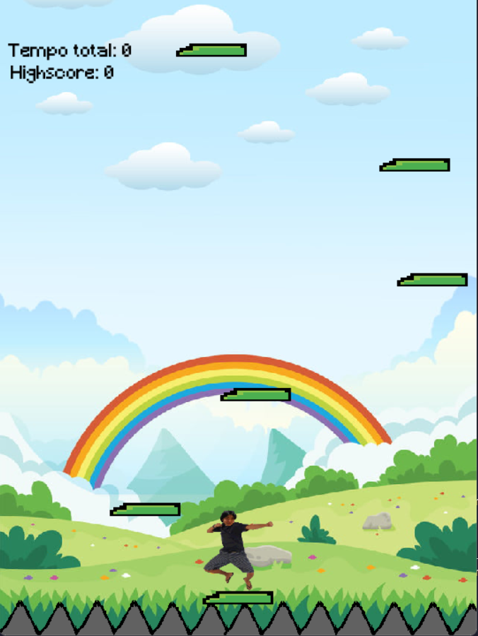

[](https://classroom.github.com/a/F62_0SL3)
[](https://classroom.github.com/online_ide?assignment_repo_id=10907833&assignment_repo_type=AssignmentRepo)
# Toshi's Coxinha Adventure

Este é o proejeto de um jogo do estilo parecido com o "infinite jumping game", desenvolvido por Henrique Junqueira e Luca Feltrin do curso de C.Comp do Insper

## Descrição do jogo

O jogo consiste em um personagem(Toshi) pulando diversas plataformas para chegar a seu destino, nesse caso uma coxinha. As plataformas ,a partir de um momento, ficam descendo sem parar, para que o player não tenha muito tempo para pensar em seu próximo movimento.

## Preparação

Primeiramente é necessário ter o Python 3 instalado no computador. Além disso é também necessário ter a biblioteca
pygame instalada no PC. Para instalar a biblioteca, copie a mensagem abaixo no terminal do seu VScode:

```bash
pip install pygame
```

## Como jogar

Após ter seguido os passos acima ["Preparação"](#preparação) é hora de aprender os comandos do jogo.


- **Movimento** : Teclas 'A' , 'D' e 'ESPAÇO'. Elas irão te mover para a esquerda, direita e pular, respectivamente.

Para jogar basta apenas cliclar com o botão esquerdo do mouse no retângulo escrito 'PLAY' já dentro do jogo. Caso queira ver novamente as instruções de como se movimentar, basta cliclar em no retângulo escrito
'INFO'. Dentro da Tela 'INFO', para voltar apenas clique na seta no canto superior esquerdo.

## Telas do jogo

Aqui estão as duas telas principais de nosso jogo, para ver as demais telas(info,ganhar e perder) **experimente** nosso jogo ;)





## Créditos 

Som pulo/musica - Sound Effect from <a href="https://pixabay.com/?utm_source=link-attribution&amp;utm_medium=referral&amp;utm_campaign=music&amp;utm_content=6462">Pixabay</a>

Ideia pulo personagem - minuto 96 - <a href="https://www.youtube.com/watch?v=AY9MnQ4x3zk&t=6443s">Youtube</a>
